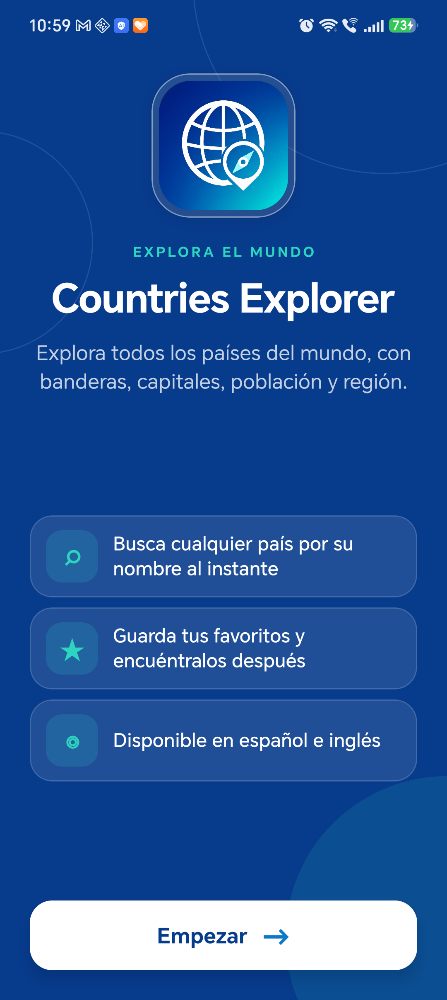
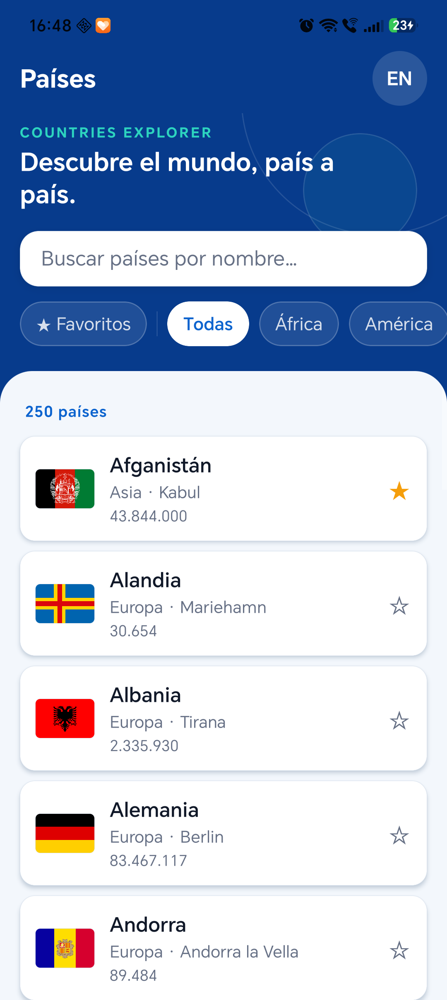
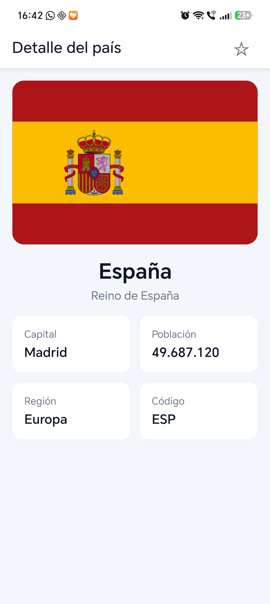
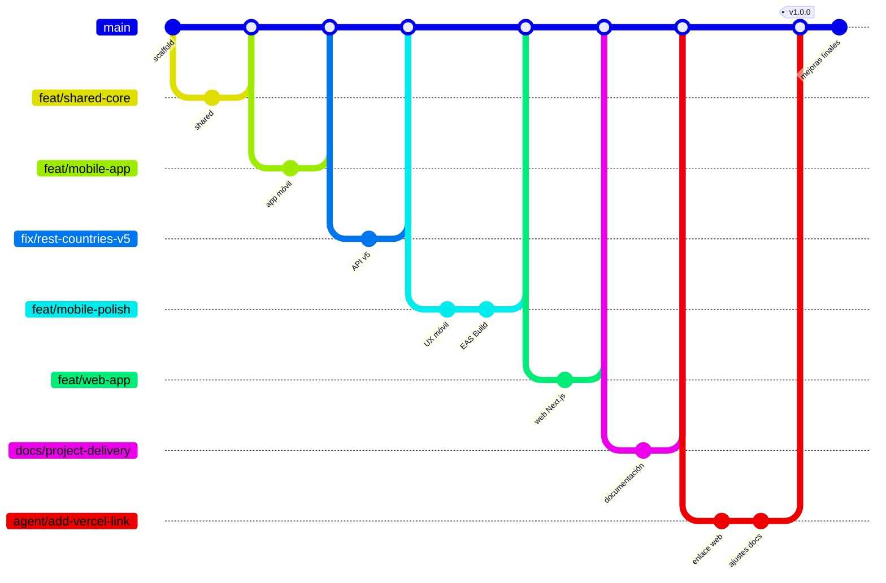

# Countries Explorer

Aplicación cross-platform para explorar países mediante la API de
[REST Countries](https://restcountries.com/). El proyecto incluye una aplicación móvil con
Expo / React Native —la entrega principal— y una web companion sencilla con Next.js.

## Entrega

La entrega incluye el código fuente completo del monorepo, la aplicación móvil Expo y la
aplicación web Next.js. Ambas plataformas reutilizan la lógica de dominio de
`@countries/shared`.

### Código fuente

Este repositorio contiene:

- `mobile/`: aplicación Expo / React Native.
- `web/`: aplicación Next.js.
- `shared/`: tipos, cliente de API, mappers, formatters y tests compartidos.

Las instrucciones de instalación, ejecución y tests se encuentran más abajo en este documento.

### Versiones disponibles para evaluación

- **Web desplegada:** [countries-explorer-web.vercel.app](https://countries-explorer-web.vercel.app/).
- **Android APK v1.0.0:** [descargar e instalar](https://github.com/MigVarona/countries-explorer/releases/download/v1.0.0/countries-explorer-v1.0.0.apk).
- **Detalles de la compilación Android:** [Expo EAS Build](https://expo.dev/accounts/mivarona/projects/countries-explorer/builds/93d07509-dbdd-4cd2-9cba-2f91381ead21).

El APK y la web desplegada se proporcionan para facilitar la evaluación. Todo el proyecto también
puede instalarse y ejecutarse localmente siguiendo las instrucciones de este README.

## Funcionalidades

### Aplicación móvil

- Lista de países con `FlatList` y carga incremental.
- Búsqueda por nombre con debounce.
- Filtros por región y favoritos persistidos.
- Detalle con bandera, capital, población, región y datos complementarios.
- Navegación mediante Expo Router y ruta dinámica `country/[id]`.
- Estados explícitos de carga, vacío y error con reintento.
- Interfaz en español e inglés.
- Detección del idioma del dispositivo y persistencia con AsyncStorage.
- Caché y estado de servidor con TanStack Query.
- Diseño adaptable de una a tres columnas.
- Soporte de SVG con fallback a PNG para las banderas.
- Prácticas básicas de accesibilidad.

### Web companion

- Next.js App Router y TypeScript.
- Lista y búsqueda de países con debounce.
- Detalle por país.
- Estados de carga, vacío y error.
- Carga incremental de resultados.
- Diseño responsive con Tailwind CSS.

## Capturas de la aplicación móvil

| Inicio | Lista de países | Detalle |
| --- | --- | --- |
|  |  |  |

También se incluyen ejemplos de
[favoritos](docs/screenshots/mobile-favorites.png),
[detalle ampliado](docs/screenshots/mobile-detail-more.png) y
[diseño horizontal](docs/screenshots/mobile-landscape.png).

## Tecnologías y versiones

| Tecnología | Versión usada |
| --- | --- |
| Node.js | 22.23.0 |
| npm | 10.9.8 |
| Expo SDK | 57.0.8 |
| React Native | 0.86.0 |
| React | 19.2.3 |
| Next.js | 15.5.21 |
| TypeScript | 5.8 / 6.0 |
| TanStack Query | 5.x |
| Tailwind CSS | 4.x |

## Estructura

```text
countries-explorer/
├── mobile/   Aplicación Expo / React Native
├── web/      Web companion con Next.js
└── shared/   Tipos, cliente API, mappers, formatters y lógica compartida
```

`@countries/shared` concentra la lógica de dominio reutilizada por móvil y web:

- Tipos TypeScript.
- Cliente de REST Countries.
- Normalización de respuestas.
- Búsqueda y ordenación.
- Formateo de población.
- Constantes.

Los componentes visuales no se comparten porque React Native y la web necesitan patrones de UI
diferentes.

## Trabajo en ramas

El proyecto se desarrolló de forma incremental en ramas temáticas y se integró en `main` mediante
merge commits, conservando en el historial la separación entre cada bloque de trabajo:



> El gráfico simplifica algunos commits para mostrar con claridad el flujo de creación, desarrollo
> y fusión de las ramas. El historial completo se puede consultar en GitHub.

| Rama | Trabajo realizado |
| --- | --- |
| `feat/shared-core` | Tipos, cliente de REST Countries, mappers, formatters y tests compartidos. |
| `feat/mobile-app` | Aplicación móvil base: listado, búsqueda, detalle e internacionalización. |
| `fix/rest-countries-v5` | Adaptación del cliente compartido a REST Countries v5. |
| `feat/mobile-polish` | Favoritos, filtros, mejoras visuales, branding y configuración de EAS Build. |
| `feat/web-app` | Aplicación web companion con Next.js. |
| `docs/project-delivery` | Documentación de instalación, entrega y capturas. |
| `agent/add-vercel-link` | Enlace al despliegue web y ajustes finales de la documentación. |

La convención utilizada distingue nuevas funcionalidades (`feat/*`), correcciones (`fix/*`) y
documentación (`docs/*`). Tras validar cada bloque, su rama se fusionó en `main`; la versión
entregable quedó marcada con la etiqueta `v1.0.0`.

## Requisitos

- Node.js 22.
- npm 10 o posterior.
- Una API key de [REST Countries](https://restcountries.com/sign-up).
- Expo Go, un emulador o un dispositivo Android/iOS para probar la aplicación móvil.

## Instalación

Desde la raíz:

```bash
npm install
```

El repositorio usa npm workspaces, por lo que este comando instala las dependencias de `shared`,
`mobile` y `web`.

## Variables de entorno

REST Countries v5 requiere autenticación. Los archivos reales de entorno están ignorados por Git.

### Móvil

```bash
cp mobile/.env.example mobile/.env
```

Editar `mobile/.env`:

```dotenv
EXPO_PUBLIC_RESTCOUNTRIES_API_KEY=your_api_key_here
```

### Web

```bash
cp web/.env.example web/.env.local
```

Editar `web/.env.local`:

```dotenv
NEXT_PUBLIC_RESTCOUNTRIES_API_KEY=your_api_key_here
```

Para llamadas desde el navegador, añadir `localhost` a los hostnames autorizados de la API key en
el panel de REST Countries.

> Las variables `EXPO_PUBLIC_*` y `NEXT_PUBLIC_*` se incluyen en el cliente y no deben considerarse
> secretas. No se deben reutilizar para credenciales privadas.

## Ejecutar la aplicación móvil

Desde la raíz:

```bash
npm run mobile
```

Después:

1. Escanear el QR con Expo Go, o
2. abrir la aplicación en un emulador/dispositivo compatible.

También se puede iniciar desde el workspace:

```bash
cd mobile
npx expo start
```

Si Expo conserva recursos antiguos:

```bash
npx expo start --clear
```

## Ejecutar la web

Desde la raíz:

```bash
npm run web
```

Abrir [http://localhost:3000](http://localhost:3000). Si el puerto está ocupado, Next.js mostrará
en la terminal el puerto alternativo utilizado.

## Tests y comprobaciones

Ejecutar todos los tests:

```bash
npm test
```

Comprobaciones de TypeScript:

```bash
npm run typecheck --workspace shared
npx tsc --noEmit -p mobile/tsconfig.json
npm run typecheck --workspace web
```

Compilar la web:

```bash
npm run build --workspace web
```

Los tests usan Vitest en `shared` y Jest / jest-expo en `mobile`.

## Generar el APK

La configuración `preview` de `mobile/eas.json` produce un APK instalable mediante EAS Build.

### 1. Instalar y autenticar EAS CLI

```bash
npm install --global eas-cli
eas login
```

### 2. Configurar la variable para el entorno preview

Crear `EXPO_PUBLIC_RESTCOUNTRIES_API_KEY` en:

```text
expo.dev → Project settings → Environment variables
```

Asignarla al entorno `preview`. También puede gestionarse con `eas env:create`.

### 3. Crear la build

```bash
cd mobile
eas build --platform android --profile preview
```

EAS proporciona al terminar:

- Un archivo `.apk`.
- Una URL de descarga.
- Un código QR para instalarlo.

Copiar la URL definitiva en la sección **Entrega** de este README. Para una entrega estable también
se puede adjuntar el APK a una GitHub Release.

## Decisiones técnicas

- **Monorepo con npm workspaces:** evita duplicar tipos y lógica entre plataformas.
- **TanStack Query en móvil:** estructura caché, carga, reintentos y errores de la API.
- **Filtrado local:** el conjunto de aproximadamente 250 países se descarga y cachea; las búsquedas
  posteriores son inmediatas y no consumen una petición por cada tecla.
- **Debounce:** evita operaciones innecesarias mientras el usuario escribe.
- **`cca3` como identificador:** proporciona claves estables para listas y rutas.
- **Expo Router:** mantiene rutas declarativas y detalle dinámico.
- **i18n solo obligatorio en móvil:** la web se mantiene intencionadamente simple.
- **Banderas SVG con fallback:** ofrece buena nitidez sin perder robustez.

## Simplificaciones y trade-offs

- La aplicación móvil concentra la mayor parte del diseño y funcionalidad, como requiere la prueba.
- La web no replica favoritos ni traducciones.
- La carga incremental limita el renderizado; no se implementó una paginación visual completa.
- La API key del cliente queda incorporada en las aplicaciones frontend y está sujeta a la cuota
  configurada en REST Countries.
- No se comparten componentes UI entre React Native y Next.js.
